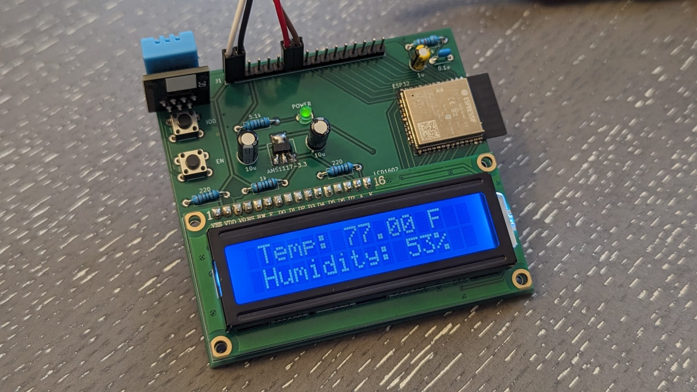
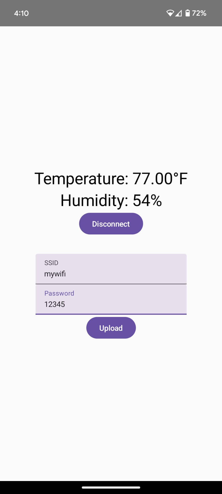
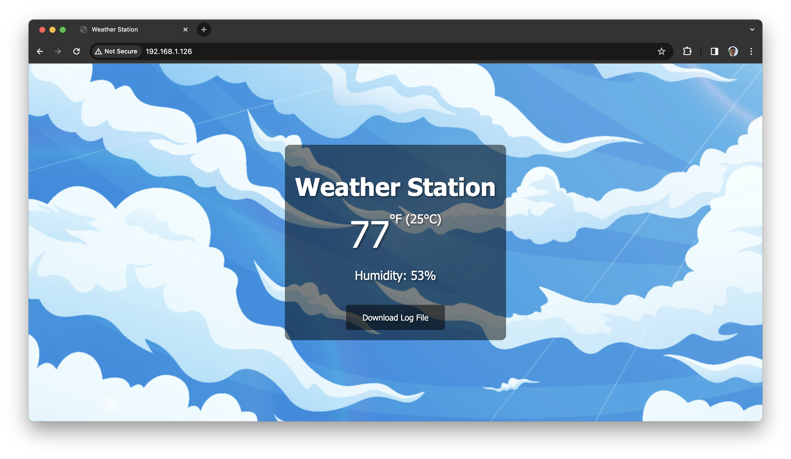
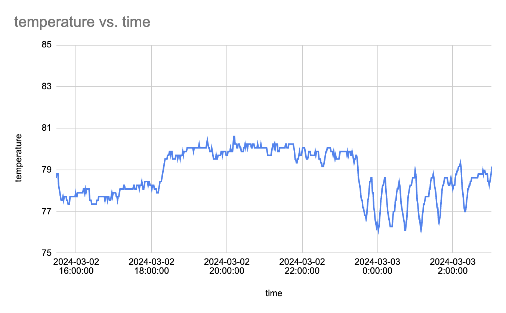

# ESP32 Weather Station
## Project Overview
The goal of this project is to learn more about wireless communication protocols in embedded systems by programming an ESP32 to serve temperature and humidity data to both a mobile phone (through bluetooth) and a computer (through wifi). It involves building a custom PCB with a sensor, display, and ESP32 module, and then programming that module to communicate with the wired components on the board and other devices wirelessly as mentioned.
### Features
- Built on a custom PCB.

  

- Serves weather data to a mobile phone via an app.

  

- Serves weather data to a computer via the browser.

  

- Serves a downloadable file of data history.

  

## Hardware
The hardware of the project consists of the ESP32 module, a DHT11 temperature and humidity sensor, a 1602 LCD display module, and an AMS1117-3.3 voltage regulator, along with the required peripheral components. The voltage regulator supplies the ESP32 module with the required 3.3V power, whereas the sensor and display run off the main 5V power. GPIOs are connected so that the ESP32 can communicate with the sensor and display.
## Firmware
This project is built on FreeRTOS, which allows us to schedule tasks that run concurrently without blocking. There are 5 main tasks:
- Read Temperature and Humidity
- Update LCD Display
- Bluetooth Low Energy GATT Server
- Connect Wi-Fi
- HTTP Server
### Read Temperature and Humidity
The data communication protocol used by the DHT11 is a unique protocol based on timing. First, the open drain data bus is pulled low for 20 ms by the MCU to indicate a read request. Then, the bus is pulled low for 80 us by the sensor to acknowledge the request, followed by 40 data bits. The data consists of 8 bit humidity integral value, 8 bit humidity tenths place value (always 0), 8 bit temperature integral value, 8 bit temperature tenths place value (both in celsius), and 8 bit checksum. A 0 is transmitted as a 50 us low pulse followed by a 30 us high pulse. A 1 is transmitted by a 50 us low pulse followed by a 70 us high pulse. The code simply waits for the rising and falling edges and times the pulses to read the data.
### Update LCD Display
Commands are sent to the LCD by setting the data lines into specific positions and then pulsing the E input. This task will initialize the LCD by putting it into two-line mode and removing the cursor. Then, when it receives a signal from the Read Temperature and Humidity task that a new message is available, it sends all the characters to the display one-by-one.
### Bluetooth Low Energy GATT Server
The BLE GATT Server is configured with a single service that contains 3 characteristics: temperature and humidity, SSID, and password. The temperature and humidity characteristic has a client configuration descriptor which allows the client to subscribe to notifications. This allows the ESP32 to send new data points immediately upon reading them from the sensor. The other two characteristics allow the client (mobile app) to upload wifi credentials so that the ESP32 can connect to wifi and host the website.
### Connect Wi-Fi
The connect_wifi task simply allows us to attempt to connect to the local wifi network using the stored credentials in nvs flash. When the user updates the credentials via the app, the new credentials are stored in the nvs flash memory.
### HTTP Server
The http_server task hosts the http web server which provides an alternative way to read the live temperature and humidity data from the ESP32. The IP address given to the ESP32 can be entered into the url bar of a web browser, which will perform an HTTP GET request to the ESP32. The code will take a template html file from the nvs flash and fill in the appropriate temperature and humidity data into the template, and then send the result as an HTTP response.
## Software
The mobile app is currently written in Kotlin for Android Studio. I am planning to transition to a cross-platform framework in the future.
## References
### Datasheets
- [DHT11](https://www.mouser.com/datasheet/2/758/DHT11-Technical-Data-Sheet-Translated-Version-1143054.pdf)
- [LCD1602](https://www.openhacks.com/uploadsproductos/eone-1602a1.pdf)
- [ESP32-WROOM-32E](https://www.espressif.com/sites/default/files/documentation/esp32-wroom-32e_esp32-wroom-32ue_datasheet_en.pdf)
- [ESP32](https://www.espressif.com/sites/default/files/documentation/esp32_datasheet_en.pdf)
- [ESP32 DevKitC V4](https://dl.espressif.com/dl/schematics/esp32_devkitc_v4-sch.pdf)
### Tutorials
- [ESP-IDF GATT Server](https://github.com/espressif/esp-idf/blob/master/examples/bluetooth/bluedroid/ble/gatt_server/tutorial/Gatt_Server_Example_Walkthrough.md)
- [ESP-IDF GATT Server Service Table](https://github.com/espressif/esp-idf/blob/master/examples/bluetooth/bluedroid/ble/gatt_server_service_table/tutorial/Gatt_Server_Service_Table_Example_Walkthrough.md)
- [ESP32 Custom PCB](https://youtu.be/S_p0YV-JlfU?si=5V8AhUmoeL_tlAL8)
### Documentation
- [ESP-IDF](https://docs.espressif.com/projects/esp-idf/en/latest/esp32/)
- [Android](https://developer.android.com/reference)
